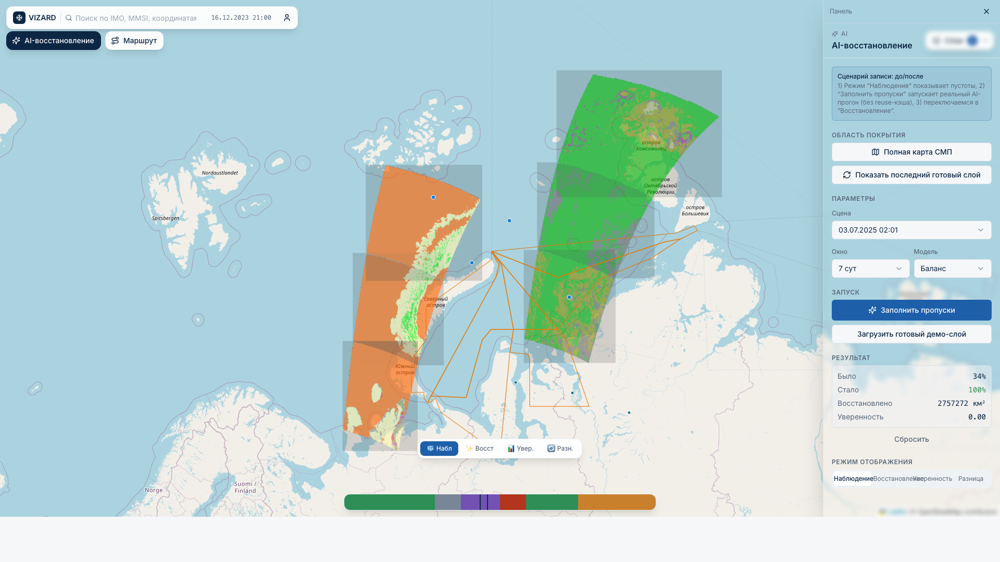
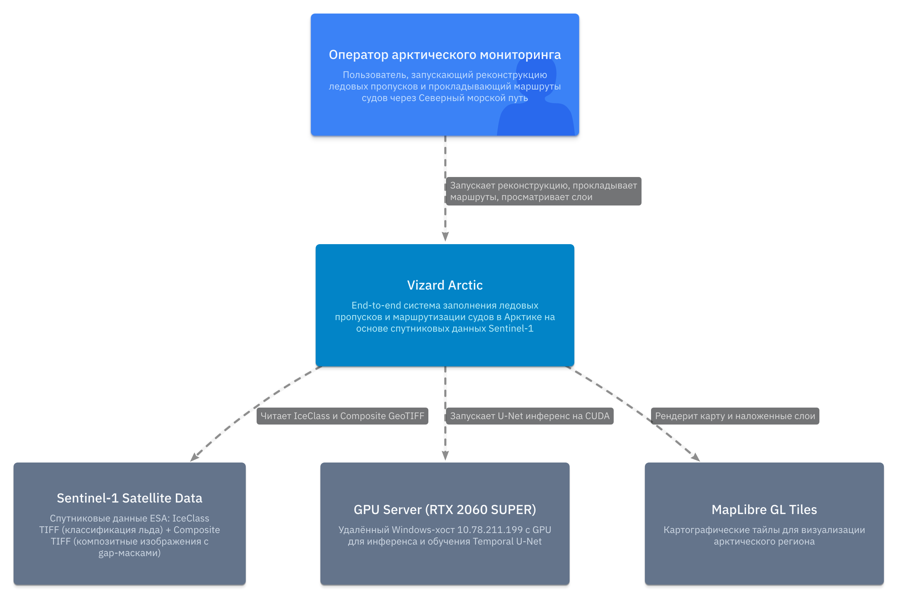
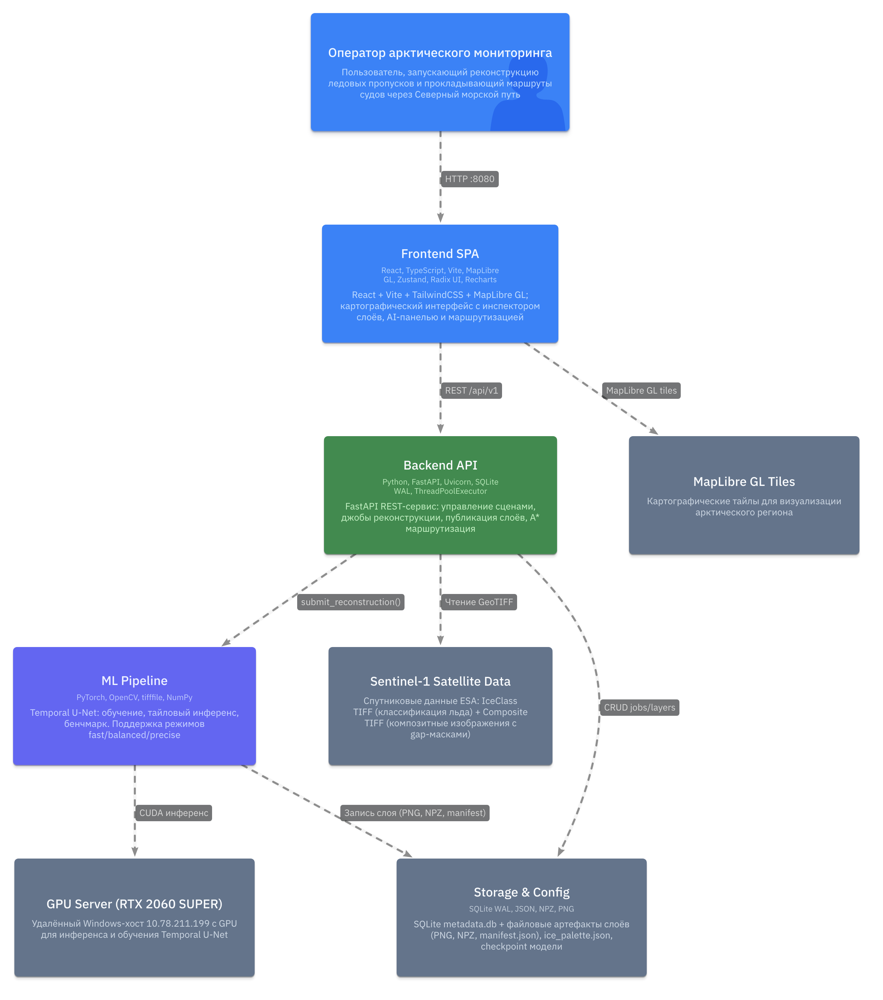
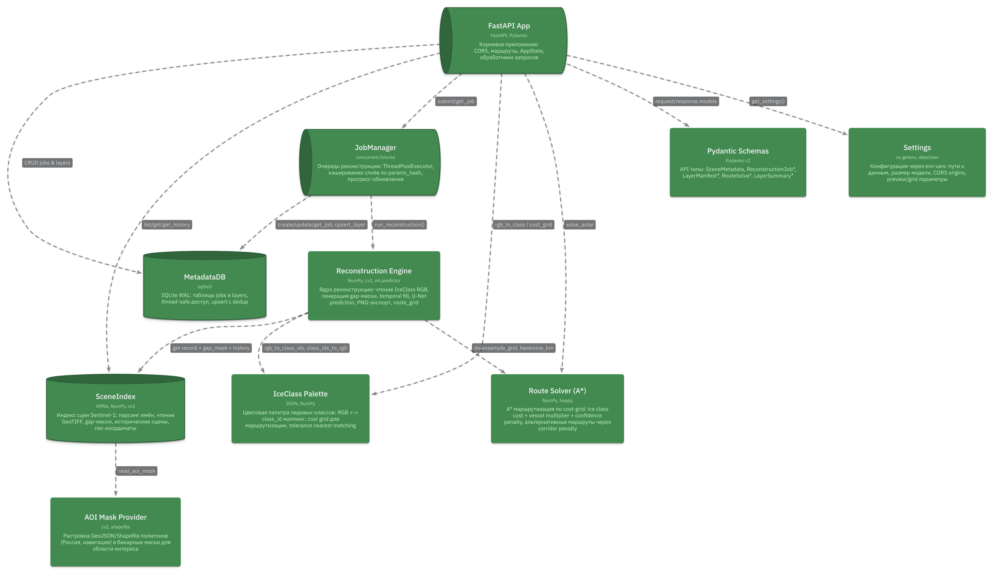
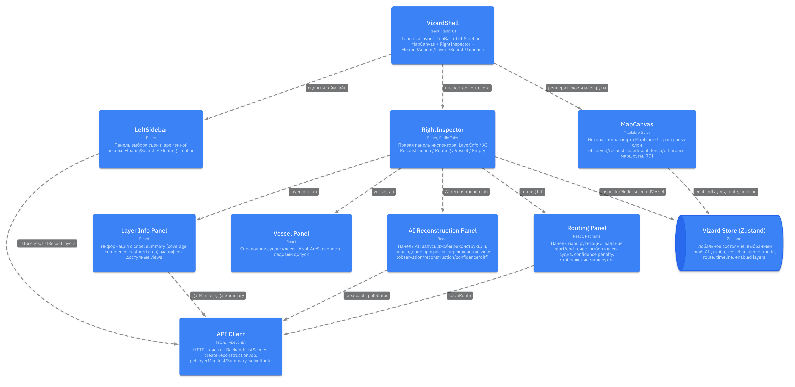
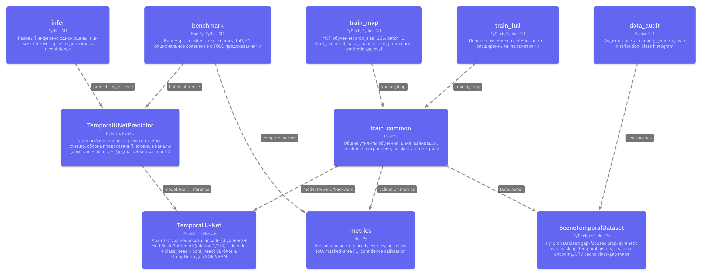
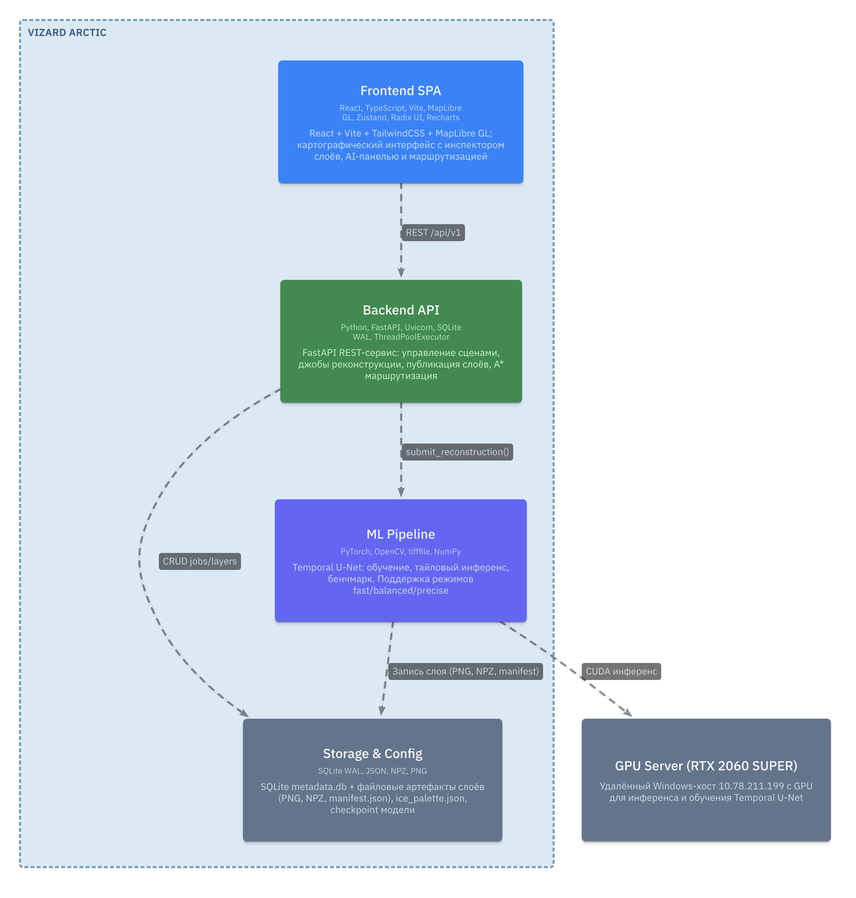
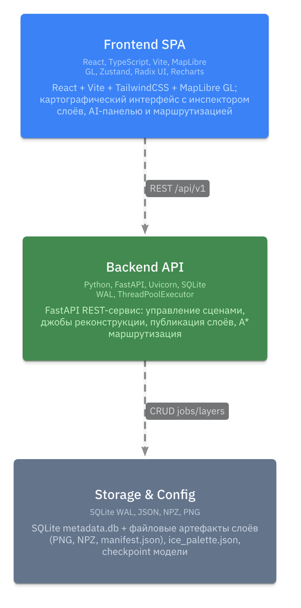

# Vizard Arctic

Vizard Arctic — прототип платформы для мониторинга льда в Арктике, AI-восстановления пропусков и прокладки маршрута судна с учетом реконструированной ледовой карты.

Репозиторий: [MakSoS1/hack_ice](https://github.com/MakSoS1/hack_ice/tree/main)

## Что показывает демо

В интерфейсе реализован сценарий «до/после»:

1. **До AI**: видим слой наблюдений (`Наблюдение`) с пустотами данных.
2. **AI-восстановление**: кнопка `Заполнить пропуски` запускает реальный reconstruction-job (без reuse-кэша в демо-режиме).
3. **После AI**: переключаемся на `Восстановление` и видим заполненные области.
4. **Маршрут**: прокладываем путь (например, от Мурманска до Сабетты/Дудинки) с учетом реконструированного льда и диагностик качества маршрута.

Если выбранные порты выходят за границы текущего слоя, интерфейс автоматически сдвигает точки внутрь покрытия (и показывает предупреждение), чтобы маршрут строился стабильно.

## Интерфейс




## Архитектура (LikeC4)

Архитектура проекта построена в **LikeC4** и лежит в папке [`vizard-arctic-c4`](vizard-arctic-c4).

- Source model: [`vizard-arctic-c4/vizard-model.c4`](vizard-arctic-c4/vizard-model.c4)
- Rendered HTML: [`vizard-arctic-c4/vizard-architecture.html`](vizard-arctic-c4/vizard-architecture.html)
- PDF: [`vizard-arctic-c4/vizard-arctic-architecture.pdf`](vizard-arctic-c4/vizard-arctic-architecture.pdf)
- PNG-диаграммы:
  - 
  - 
  - 
  - 
  - 
  - 
  - 

## Структура репозитория

- `backend/` — FastAPI, job manager, scene/layer API, route solver.
- `frontend/` — React + MapLibre UI для демо.
- `ml/` — инференс/обучение Temporal U-Net.
- `configs/` — палитра ледовых классов и конфиги.
- `scripts/` — утилиты запуска и подготовки.
- `storage/` — runtime-артефакты слоев и metadata DB.
- `vizard-arctic-c4/` — LikeC4-модель и рендеры архитектуры.

## Быстрый запуск (рекомендованный: backend на Windows ПК, frontend на macOS)

### 1) Запуск backend на удаленном ПК (Windows)

```powershell
cd C:\Users\maksi\projects\vizard-arctic
powershell -ExecutionPolicy Bypass -File .\scripts\setup_remote.ps1
powershell -ExecutionPolicy Bypass -File .\scripts\start_backend_keepalive.ps1
```

Backend должен стать доступен по `http://10.78.211.199:8000/health`.

### 2) Запуск frontend на macOS

```bash
cd /Users/maksos/Documents/work/hack_ice/_repo_hack_ice/frontend
npm install
npm run dev -- --host 0.0.0.0 --port 8080
```

Открыть: `http://localhost:8080`

По умолчанию dev-прокси фронтенда настроен на удаленный backend:

- `frontend/vite.config.ts` -> `proxy /api -> http://10.78.211.199:8000`

## Локальный запуск (все на одной Windows-машине)

```powershell
cd C:\Users\maksi\projects\vizard-arctic
powershell -ExecutionPolicy Bypass -File .\scripts\setup_remote.ps1

cd .\backend
..\.venv\Scripts\python.exe run.py

# в другом окне
cd C:\Users\maksi\projects\vizard-arctic\frontend
npm run dev -- --host 0.0.0.0 --port 8080
```

## Сценарий записи видео (рекомендуемый)

1. Открыть `http://localhost:8080`.
2. В правой панели `AI-восстановление` оставить режим `Наблюдение` — показать пустоты.
3. Нажать `Заполнить пропуски` и дождаться завершения job.
4. Переключиться в `Восстановление`/`Разница` и показать, что область заполнена.
5. Перейти в `Маршрут`, выбрать точки (`Мурманск -> Сабетта/Дудинка`), нажать `Построить`.
6. Показать:
   - основную и альтернативные траектории;
   - `risk_reduction_vs_baseline_pct`;
   - `distance_over_baseline_km`;
   - `model_mode_effective` (balanced/precise vs fallback).

## API

- `GET /health`
- `GET /api/v1/scenes`
- `POST /api/v1/reconstruction/jobs`
- `GET /api/v1/reconstruction/jobs/{job_id}`
- `GET /api/v1/layers/recent`
- `GET /api/v1/layers/{layer_id}/manifest`
- `GET /api/v1/layers/{layer_id}/summary`
- `GET /api/v1/layers/{layer_id}/{view}.png`
- `POST /api/v1/routes/solve`

## Режимы модели

`POST /api/v1/reconstruction/jobs` поддерживает:

- `fast` — эвристическое восстановление.
- `balanced` — модельный inference в сбалансированном режиме.
- `precise` — более точный inference с большим overlap.

Для демо фронтенд отправляет `force_recompute=true`, чтобы запуск был реальным, а не мгновенным cache-hit.

## Альтернативная реализация (Monte Carlo)

В проекте есть отдельная ветка-реализация на Monte Carlo в другой папке (вне этого репозитория):

- `C:\Users\maksi\projects\vizard-arctic-monte`

Эта реализация не удалена и может использоваться для сравнительных экспериментов с текущим подходом.

## Примечания

- Если backend недоступен с macOS, проверьте firewall-правило на порту `8000` на Windows.
- Если видите `fast_fallback`, проверьте наличие checkpoint и импорт `ml/predictor.py`.
